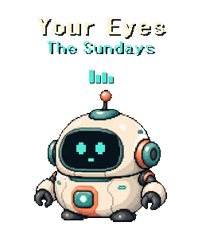
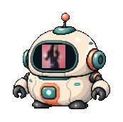
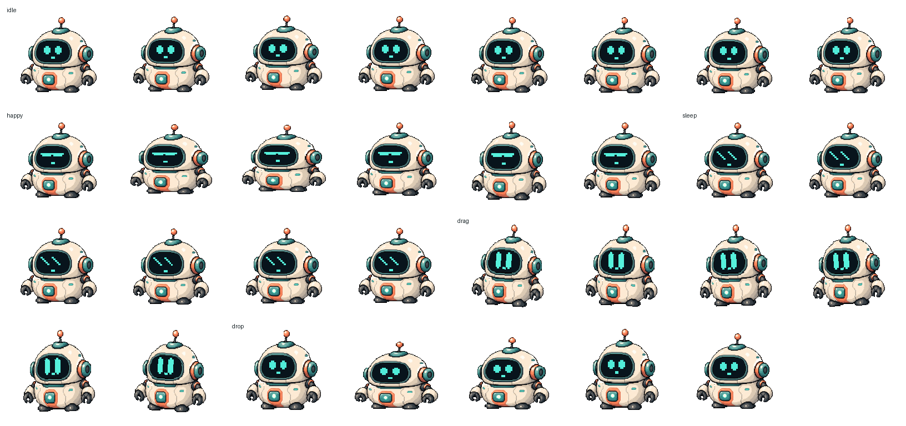
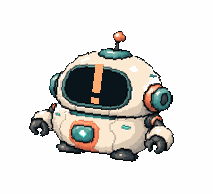

# Pixel Robot Desktop Pet

一个 Windows 像素风机器人桌宠原型，使用 Python、Tkinter 和 Pillow 实现。

它会以透明置顶窗口的形式停留在桌面上，可以拖拽移动、点击互动、播放音效、显示音乐信息、控制系统媒体播放，并支持自定义闹钟提醒。项目目前更偏向视觉和动效原型，重点是让小机器人看起来足够可爱、灵活、有存在感。

## 效果预览

下面的图片和 GIF 都是导出的干净预览素材，不包含桌面截图或个人环境信息。

### 桌宠本体


### 歌名显示

播放音乐时，歌名和歌手会以像素风文字显示在机器人上方，播放中会出现跳动的均衡器。



### 脸部悬浮控制

鼠标悬浮到机器人脸部时，会显示上一首、暂停、播放、下一首等媒体控制图标。身体和天线区域不会触发这些按钮。


### 切歌封面弹出

切换歌曲时，机器人会短暂显示专辑信息，并把专辑封面像素化后显示到屏幕里。



### 动画帧

当前已经拆出待机、点击、拖拽、下落、睡觉和闹钟等状态帧，后续可以继续扩展更多动作。



### 闹钟提醒

闹钟到点后，机器人会播放提示音、显示提醒文字，并进行更明显的抖动动画。



## 功能特性

- 透明置顶桌宠窗口
- 像素风机器人素材和硬边透明处理
- 点击表情变化和像素粒子反馈
- 拖拽移动、拉伸和回弹动效
- 右键菜单管理睡觉、大小、音效、音乐控制、闹钟、自启动和退出
- 多档尺寸切换，并保存到本地设置
- 互动音效
- Windows 系统媒体键控制：播放/暂停、上一首、下一首
- 读取媒体会话中的歌名、歌手、专辑名、播放状态和封面
- 切歌时在机器人屏幕中显示像素化专辑封面
- 多闹钟管理，支持自定义时间和提醒名称
- 闹钟响铃时强抖动、提示音、稍后提醒和点击关闭
- 游戏性能模式：检测到指定游戏在前台时，临时隐藏桌宠并暂停高频刷新
- 可选开机自启动

## 环境要求

- Windows 10 或更高版本
- Python 3.10+
- Pillow
- fonttools
- 可选：`winsdk`，用于读取更完整的 Windows 媒体会话信息

安装依赖：

```powershell
pip install -r requirements.txt
```

如果不安装 `winsdk`，桌宠主体功能仍然可以运行，但音乐信息、播放状态和专辑封面读取能力会受限。

## 快速开始

```powershell
git clone <repository-url>
cd pixel-robot-desktop-pet
python robot_pet.py
```

Windows 下也可以双击运行：

```text
run_pet.bat
```

## 基本操作

- 左键点击：触发机器人表情和粒子反馈
- 左键拖拽：移动桌宠
- 右键点击：打开功能菜单
- 悬浮到脸部：显示媒体控制图标
- 点击脸部左侧：上一首
- 点击脸部中间：播放或暂停
- 点击脸部右侧：下一首
- 睡觉时点击：唤醒
- 闹钟响铃时点击：关闭提醒

## 闹钟

右键菜单中的闹钟功能支持：

- 查看和管理多个闹钟
- 添加自定义闹钟时间
- 设置提醒名称
- 快速设置 10 分钟后、30 分钟后、明天早上等预设
- 稍后 5 分钟提醒
- 清空或关闭闹钟

支持的自定义时间格式示例：

```text
21:30
YYYY-MM-DD 21:30
MM-DD 08:30
```

## 素材与预览

- 运行时机器人图片：`assets/robot.png`
- 高清清边源图：`assets/robot-master-refined.png`
- 音乐播放指示 SVG：`assets/music-playing.svg`
- 动画帧：`assets/frames/`
- README 预览图和 GIF：`screenshots/`

## 重新生成素材

生成音效：

```powershell
python tools/make_sfx.py
```

生成机器人素材：

```powershell
python tools/make_assets.py
```

生成动画帧和预览：

```powershell
python tools/make_animation_frames.py
```

## 当前状态

这是一个早期桌宠原型，当前重点是视觉表现、动画反馈和桌面互动手感。后续可以继续扩展更多动作帧、状态表情、桌面陪伴行为，以及更完整的打包安装流程。

## 许可证

发布为公开仓库前，请根据项目需要补充许可证文件。
